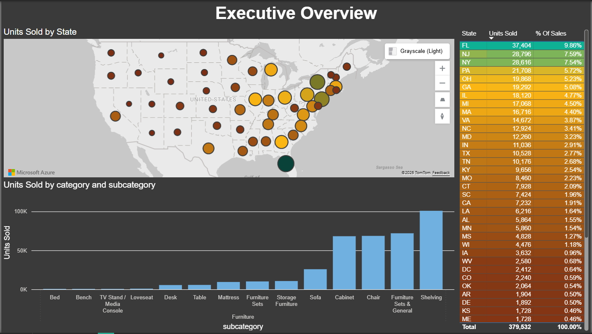
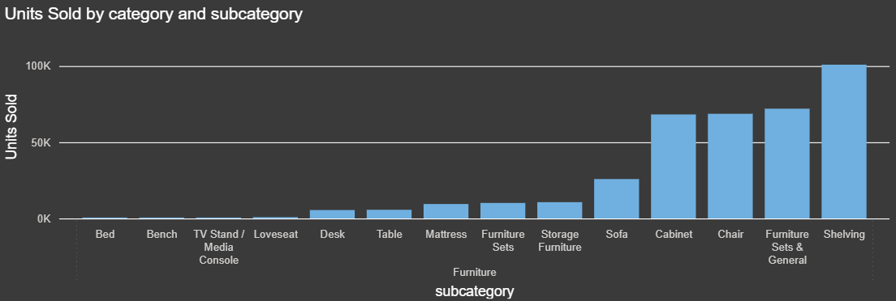
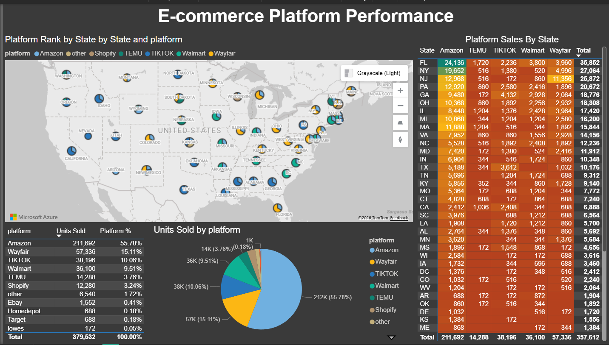

# Sales Analytics Pipeline (Python ETL + SQL Server + Power BI)

## Overview
This project demonstrates an end-to-end analytics pipeline that loads CSV exports into a SQL Server star-schema database and powers Power BI reporting.

*Tech stack:* Python (pandas, SQLAlchemy, pyodbc) · SQL Server · Power BI

---

## Business Problem
Organizations need to understand which products, platforms, and locations drive sales performance in order to optimize marketing, inventory, and channel strategy.

---

## Solution
I built a repeatable pipeline with clear separation between ingestion (staging), analytics modeling (dimensions/fact), and reporting (views + Power BI).

---

## Architecture
```
CSV Files (confidential, not included)
        ↓
Python ETL (etl/)
        ↓
SQL Server (retail_analytics)
  - Staging tables (stg_*)
  - Dimension tables (dim_*)
  - Fact table (fact_sales)
        ↓
Reporting View (vw_sales_product_geo)
        ↓
Power BI Dashboard (powerbi/)
```
---

## Data Model (Star Schema)

The analytics layer follows a star-schema design optimized for reporting and BI tools.

### Staging Tables
- stg_order_export_raw — raw order-level data loaded from CSV
- stg_product_master — raw product reference data

### Dimension Tables
- dim_customer — customer attributes for segmentation
- dim_date — calendar attributes (day, month, quarter, year)
- dim_platform — sales platform / channel
- dim_product — product attributes and categorization

### Fact Table
- fact_sales — transactional sales metrics

*Grain:*  
One row per product per order per day per platform.

---

## ETL Process

The ETL pipeline is implemented in Python and designed to be repeatable and environment-safe.

**Steps:**
1. Load CSV files into staging tables
2. Normalize data types (dates, numeric fields)
3. Generate and maintain the `dim_date` dimension
4. Upsert product and platform dimensions
5. Load analytics-ready records into `fact_sales`

Raw input files are excluded from the repository for confidentiality

### SQL Transformations

Product categorization and subcategorization are applied using SQL
transformation scripts located in sql/transformations/.

These rules were iteratively refined after reviewing Power BI results,
particularly to reduce an oversized "Other Furniture" category and
improve reporting accuracy.

---

## Dashboard (Power BI)

The Power BI dashboard consumes the reporting view vw_sales_product_geo.

Key visuals include:
- Sales by state / geography
- Product performance
- Platform performance
- Day-of-week sales trends

Dashboard screenshots are available in the /screenshots folder.

---

## Dashboard Screenshots

### Executive Overview


This view highlights overall sales distribution by state and the
dominant product subcategories driving unit volume.

---

### Product Category & Subcategory Performance


This chart shows how demand is concentrated in a small number of
furniture subcategories, validating the need for refined product
classification rules.

---

### E-commerce Platform Performance


Platform-level analysis reveals significant regional differences,
with Amazon dominating overall volume while Wayfair and TikTok
over-index in specific states.

---

## Data Privacy

Raw CSV inputs and any company-sensitive data are excluded from this repository.
The project demonstrates structure, logic, and analytics patterns using the same
architecture applied in real-world scenarios.

---

## How to Run (Local)

1. Create the database:
   - sql/create_database.sql

2. Create tables:
   - sql/schema/*.sql

3. Create reporting view:
   - sql/views/*.sql

4. Install dependencies:
   ```bash
   pip install -r etl/requirements.tx

---

## Key Insights

- *Demand is geographically concentrated.* Total volume is *379,532 units*, and the top states contribute a disproportionate share:
  *FL (9.86%), **NJ (7.59%), **NY (7.54%), **PA (5.72%), **OH (5.23%). The top 5 alone represent ~36%* of all units.

- *A few furniture subcategories drive most unit volume.* Within Furniture, *Shelving* is the leading subcategory by a wide margin, followed by *Furniture Sets & General, **Chair, and **Cabinet*. This indicates the business is heavily anchored on storage/organization-style furniture rather than evenly distributed demand.

- *Platform performance is heavily skewed to Amazon, but channel mix varies by state.*
  - Overall platform share: *Amazon (55.78%), **Wayfair (15.11%), **TikTok (10.06%), **Walmart (9.51%), **Temu (3.76%), **Shopify (3.24%)*.
  - State-level differences are meaningful. For example, *NJ shows unusually strong Wayfair volume* relative to Amazon, while *GA shows strong TikTok volume* compared to other states.

- *The product taxonomy work materially improved reporting accuracy.*
  The initial “Other Furniture” bucket hid the true drivers; refining subcategory rules revealed clearer demand clusters (e.g., sets vs. storage vs. seating), enabling more actionable decisions in inventory and marketing.

- Collectively, these patterns indicate that growth is driven more by targeted execution across a small number of regions, categories, and platforms than by broad national expansion.

## Recommendations

- *Prioritize inventory and promotions around the highest-volume subcategories:*
  Focus forecasting, replenishment, and merchandising on *Shelving, **Chairs, **Cabinets, and **Furniture Sets*. These categories have the strongest pull and will drive the fastest returns on availability and ad spend.

- *Run geo-targeted campaigns in top states first, then expand:*
  Allocate the majority of budget and inventory depth to *FL, NJ, NY, PA, and OH* before scaling to mid-tier states. This improves ROI by concentrating effort where demand is already proven.

- *Align platform strategy to regional channel performance:*
  - Treat *Amazon* as the primary growth engine (majority share).
  - In states where *Wayfair over-indexes* (e.g., NJ/NY), increase Wayfair-focused assortment and ads.
  - In states where *TikTok over-indexes* (e.g., GA/TX patterns visible in the platform-by-state table), push short-form creative + promotional bundles for top subcategories.

- *Use the refined taxonomy operationally (not just for reporting):*
  Keep category/subcategory rules as a maintained asset. Add a lightweight monthly check:
  “If any subcategory grows unexpectedly or ‘Other’ increases, review top SKUs and update rules.”

- *Improve decision confidence with a small set of automated data-quality checks:*
  Add checks to flag null/blank category/subcategory, unexpected spikes, and new SKUs that don’t match rules. This prevents drift and keeps Power BI insights reliable.